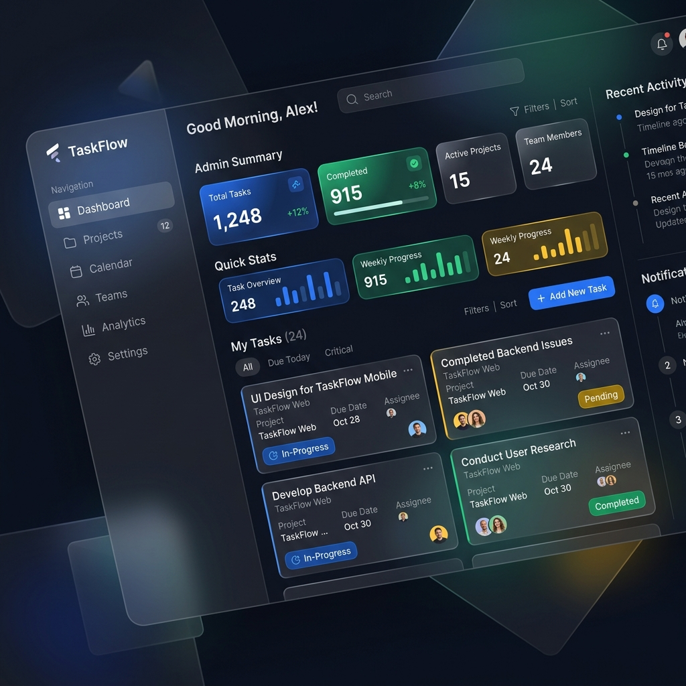

# 🚀 Task Manager Pro - Full Stack Solution

[](https://task-manager-internshala.vercel.app/)
[](https://nodejs.org/)
[](https://reactjs.org/)
[](https://www.mongodb.com/)

A premium, full-stack task management ecosystem designed for high-efficiency teams. This platform bridges the gap between simple to-do lists and complex project management tools like Jira, offering a streamlined workflow with robust **Role-Based Access Control (RBAC)**.



## 🌟 Key Features

### 🛡️ Secure Infrastructure
*   **JWT-Powered Auth**: Stateless authentication with secure HTTP-only cookie support.
*   **RBAC Architecture**: Precision-engineered roles for `Admin` and `User` hierarchies.
*   **Input Sanitization**: Multi-layer defense against XSS and injection attacks.
*   **Schema Validation**: 100% type-safe API requests handled by **Zod**.

### 👤 User Capabilities
*   **Task Ownership**: Create and manage personal task silos.
*   **Dynamic Status Control**: Seamlessly transition tasks through `Pending`, `In-Progress`, and `Completed` states.
*   **Title Update Requests**: Propose modifications for governed tasks, requiring administrative oversight.
*   **Collaborative Context**: View tasks assigned directly by team leads.

### 👑 Admin Elite
*   **Omniscient Visibility**: Full spectrum access to every task and registered user in the system.
*   **Task Orchestration**: Assign specific tasks to users during the creation phase.
*   **Administrative Oversight**: Approve or reject user-submitted title change requests with a single click.
*   **Global Summary Dashboard**: Real-time aggregate analytics showing system-wide productivity metrics.
*   **Destructive Authority**: Direct override and permanent deletion rights for all platform entities.

---

## 🛠️ Tech Stack

| Core | Technologies |
| :--- | :--- |
| **Frontend** | React 18, Vite, Vanilla CSS (Premium Dark Theme), Lucide Icons |
| **Backend** | Node.js, Express.js (v5), Mongoose ODM |
| **Database** | MongoDB Atlas (Cloud) / Local |
| **Security** | JWT, bcryptjs, Helmet, Express Rate Limit |
| **Documentation** | Swagger (OpenAPI 3.0), Postman |
| **Validation** | Zod Schema Validation |

---

## 📁 Project Architecture

```text
task-manager-internshala/
├── backend/                # Optimized Node.js Server
│   ├── src/
│   │   ├── config/         # Database, Swagger, & Env configs
│   │   ├── controllers/    # Business logic orchestration
│   │   ├── middleware/     # Auth, Error handling, Sanitization
│   │   ├── models/         # Mongoose Schemas (Task, User)
│   │   ├── routes/         # REST API endpoints
│   │   ├── services/       # Revocable JWT token services
│   │   └── validators/     # Zod schema definitions
├── frontend/               # Ultra-fast React Application
│   ├── src/
│   │   ├── App.jsx         # State-driven UI logic
│   │   ├── styles.css      # Custom Design System
│   │   └── main.jsx        # Entry point
├── docs/                   # Assets and Postman collections
└── vercel.json             # Cloud deployment configuration
```

---

## 🚀 Rapid Setup

### Prerequisites
*   Node.js **v18+**
*   MongoDB Instance (Local or Atlas)
*   NPM / Yarn

### 1. Initialization
```bash
git clone https://github.com/Adarsh09675/task-manager-internshala.git
cd task-manager-internshala
```

### 2. Backend Configuration
```bash
cd backend
npm install
touch .env # Use .env.example as template
```
**Environment Variables (`.env`):**
```env
PORT=5000
MONGODB_URI=your_mongodb_connection_string
JWT_SECRET=your_complex_secret_key
JWT_EXPIRES_IN=1d
```

### 3. Frontend Initialization
```bash
cd ../frontend
npm install
```

---

## 🏃 Execution

### Development
Launch both servers simultaneously:
```bash
# Terminal 1: Backend
cd backend
npm run dev

# Terminal 2: Frontend
cd frontend
npm run dev
```

### Production Build
```bash
# In Root Directory
npm run build
```

---

## 📖 API Documentation & Testing

Once the server is operational, explore the fully interactive **Swagger UI**:
📍 `http://localhost:5000/api-docs`

### Postman Integration
Import the collection located at `backend/docs/postman_collection.json` for ready-to-use requests including:
*   Auth (Register/Login)
*   Task CRUD Operations
*   Admin Summary
*   Update Approval Workflow

---

## 📄 License
Distributed under the **MIT License**. See `LICENSE` for more information.

## 🤝 Contact
**Adarsh** - [GitHub](https://github.com/Adarsh09675)

---
*Developed with ❤️ as a core internship project for Internshala.*
